# RELASI
## PEMBUATAN DATABASE (CompanyDB)

Code:
~~~sql
Customers
CREATE TABLE Customers (
CustomerID VARCHAR(5) PRIMARY KEY,
CompanyName VARCHAR(50),
ContactName VARCHAR(50),
Address VARCHAR(100),
City VARCHAR(50),
PostalCode VARCHAR(20),
Country VARCHAR(50),
Phone VARCHAR(20)
);
~~~

Hasil:
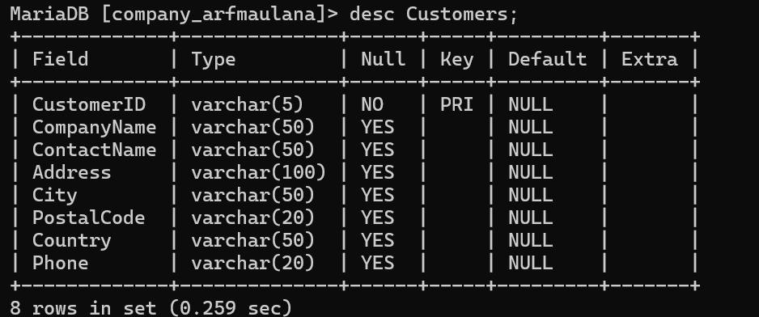

Code :
~~~sql
INSERT INTO Customers (CustomerID, CompanyName, ContactName, Address, City,
PostalCode, Country, Phone)
VALUES
('SEVES', 'Seven Seas Imports', 'Hari Kumar', '90 Wadhurst Rd.', 'London',
'OX154', 'UK', '(171) 555-1717gamba'),
('MAISD', 'Maison Dewey', 'Catherine Dewey', 'Rue Joseph Bens 532', 'Bruxelles',
'B-1180', 'Belgium', '(02) 201 24 67'),
('ISLAT', 'Island Trading', 'Helen Bennett', '75 Crowther Way', 'Cowes', 'PO31
7PJ', 'UK', '(198) 555-8888'),
('EASTC', 'Eastern Connection', 'Ann Devon', '35 King George', 'London', 'WX3FW',
'UK', '(171) 555-0297'),
('ALFKI', 'Alfreds Futterkiste', 'Maria Anders', 'Obere Str. 57', 'Berlin',
'12209', 'Germany', '030-0074321');

~~~

Hasil :
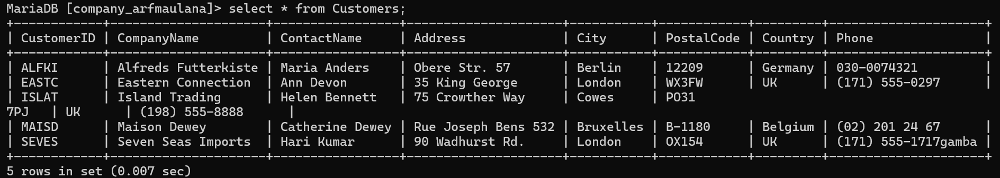

Code:
~~~sql
Employees
CREATE TABLE Employees (
EmpId INT PRIMARY KEY,
LastName VARCHAR(50),
FirstName VARCHAR(50),
Title VARCHAR(50),
Address VARCHAR(100),
City VARCHAR(50),
Country VARCHAR(50),
HomePhone VARCHAR(20)
);
~~~

Hasil :
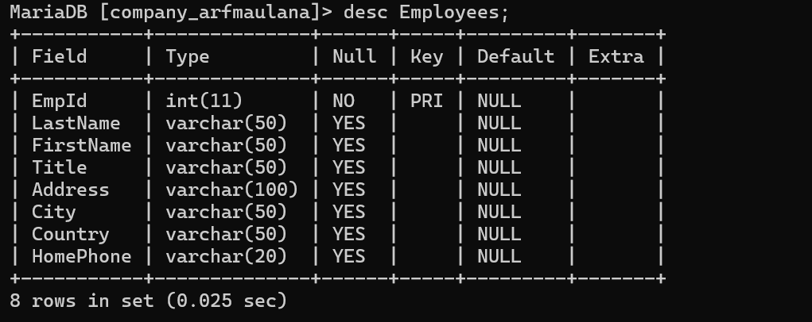
Code :
~~~sql
INSERT INTO Employees (EmpId, LastName, FirstName, Title, Address, City, Country,
HomePhone)
VALUES
(1, 'Davolio', 'Nancy', 'Sales Rep.', '507 - 20th Ave. E. Apt. 2A', 'Seattle',
'USA', '(206) 555-9857'),
(2, 'Fuller', 'Andrew', 'Vice President', '908 W. Capital Way', 'Tacoma', 'USA',
'(206) 555-9482'),
(3, 'Leverling', 'Janet', 'Sales Rep.', '722 Moss Bay Blvd.', 'Kirkland', 'USA',
'(206) 555-3412'),
(4, 'Peacock', 'Margaret', 'Sales Rep.', '4110 Old Redmond Rd.', 'Redmond',
'USA', '(206) 555-8122'),
(5, 'Buchanan', 'Steven', 'Sales Manager', '14 Garrett Hill', 'London', 'UK',
'(71) 555-9482'),
(6, 'Suyama', 'Michael', 'Sales Rep.', 'Coventry House Miner Rd.', 'London',
'UK', '(71) 555-7773'),
(7, 'King', 'Robert', 'Sales Rep.', '12 Winchester Way', 'London', 'UK', '(71)
555-5598'),
(8, 'Callahan', 'Laura', 'Sales Coord.', '4726 - 11th Ave. N.E.', 'Seattle',
'USA', '(206) 555-1189'),
(9, 'Dodsworth', 'Anne', 'Sales Rep.', '7 Houndstooth Rd.', 'London', 'UK', '(71)
555-4444');
~~~

Hasil :
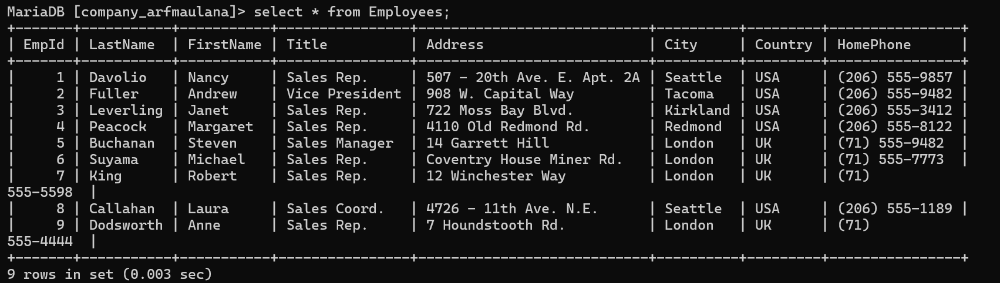

Code :
~~~sql
Products
CREATE TABLE Products (
ProductID INT PRIMARY KEY,
ProductName VARCHAR(50),
SupplierID INT,
QuantityPerUnit VARCHAR(50),
UnitPrice DECIMAL(10, 2),
UnitsInStock INT
);
~~~

Hasil :
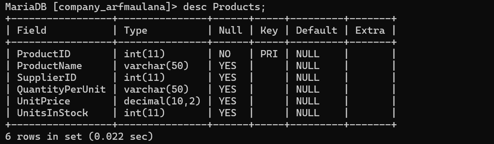

Code :
~~~sql
INSERT INTO Products (ProductID, ProductName, SupplierID, QuantityPerUnit,
UnitPrice, UnitsInStock)
VALUES
(2, 'Chang', 1, '24 - 12 oz bottles', 19.00, 17),
(5, 'Chef Anton''s Gumbo Mix', 2, '36 boxes', 21.35, 50),
(21, 'Sir Rodney''s Scones', 8, '24 pkgs. x 4 pieces', 10.00, 17),
(27, 'Schoggi Schokolade', 11, '100 - 100 g pieces', 43.90, 49),
(32, 'Mascarpone Fabioli', 14, '24 - 200 g pkgs.', 32.00, 9);
~~~
Hasil :
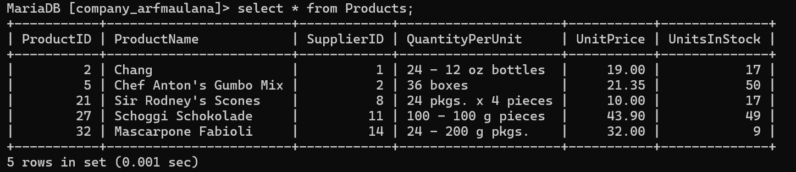

Code :

~~~sql
Insert additional data into the Products table
INSERT INTO Products (ProductID, ProductName, SupplierID, QuantityPerUnit,
UnitPrice, UnitsInStock)
VALUES
(37, 'Gravad lax', 17, '12 - 500 g pkgs.', 26.00, 11),
(39, 'Chartreuse verte', 18, '750 cc per bottle', 18.00, 69),
(41, 'Jack''s Clam Chowder', 19, '12 - 12 oz cans', 9.65, 85),
(53, 'Perth Pasties', 24, '48 pieces', 32.80, 15),
(54, 'Ravioli Angelo', 24, '24 - 250 g pkgs.', 19.50, 36),
(29, 'Hot Pepper Sauce', 2, '32 - 8 oz bottles', 21.05, 76),
(62, 'Tarte au sucre', 29, '48 pies', 49.30, 17),
(70, 'Outback Lager', 7, '24 - 355 ml bottles', 15.00, 15),
(74, 'Longlife Tofu', 4, '5 kg pkg.', 10.00, 4),
(77, 'Original Frankfurter', 12, '12 boxes', 13.00, 32);
~~~

Hasil :
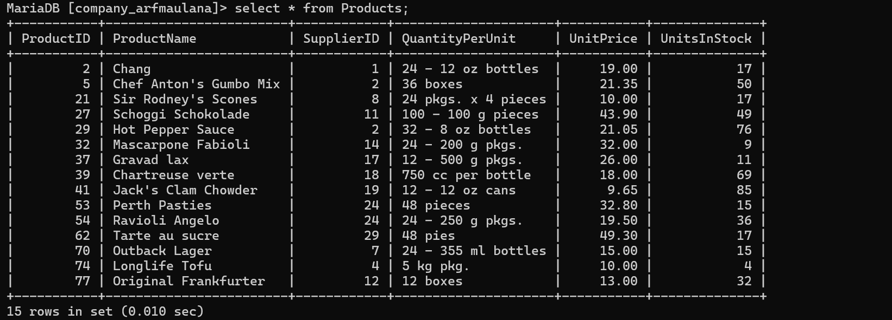

Code :
~~~sql
CREATE TABLE Orders (
OrderID INT PRIMARY KEY,
CustID VARCHAR(5),
EmpID INT,
OrderDate DATE,
RequiredDate DATE,
ShippedDate DATE,
ShipVia INT,
FOREIGN KEY (CustID) REFERENCES Customers(CustomerID),
FOREIGN KEY (EmpID) REFERENCES Employees(EmpId)
);
~~~
Hasil :
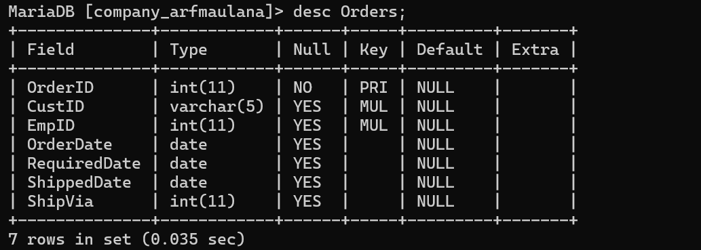

Code :
~~~sql
INSERT INTO Orders (OrderID, CustID, EmpID, OrderDate, RequiredDate, ShippedDate,
ShipVia)
VALUES
(10256, 'EASTC', 3, '1994-08-15', '1994-09-12', '1994-08-17', 2),
(10257, 'SEVES', 4, '1994-08-16', '1994-09-13', '1994-08-22', 3),
(10258, 'MAISD', 1, '1994-08-17', '1994-09-14', '1994-08-23', 1),
(10259, 'ALFKI', 4, '1994-08-18', '1994-09-15', '1994-08-25', 3),
(10260, 'ISLAT', 4, '1994-08-19', '1994-09-16', '1994-08-29', 1);
~~~

Hasil :
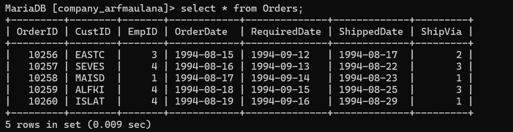

Code :
~~~sql
CREATE TABLE OrderDetails (
OrderID INT,
ProductID INT,
UnitPrice DECIMAL(10, 2),
Quantity INT,
Discount DECIMAL(4, 2),
PRIMARY KEY (OrderID, ProductID),
FOREIGN KEY (OrderID) REFERENCES Orders(OrderID),
FOREIGN KEY (ProductID) REFERENCES Products(ProductID)
);
~~~

Hasil :
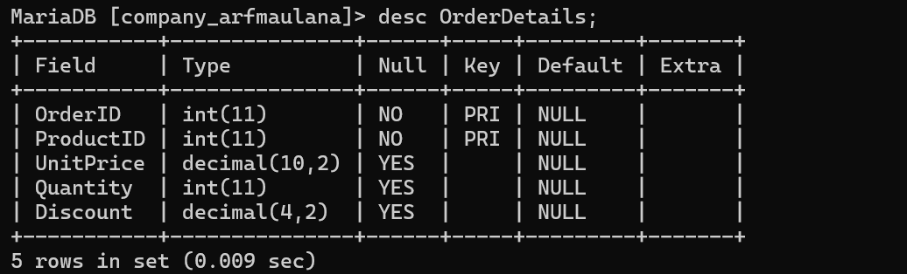

Code :
~~~sql
INSERT INTO OrderDetails (OrderID, ProductID, UnitPrice, Quantity, Discount)
VALUES
(10256, 53, 26.20, 15, 0),
(10256, 77, 10.40, 12, 0),
(10257, 27, 35.10, 25, 0),
(10257, 39, 14.40, 6, 0),
(10258, 2, 15.20, 50, 0.2),
(10258, 5, 17.00, 65, 0.2),
(10258, 32, 25.60, 6, 0.2),
(10259, 41, 7.70, 16, 0.25),
(10260, 62, 39.40, 15, 0.25),
(10260, 70, 12.00, 21, 0.25);
~~~
Hasil :

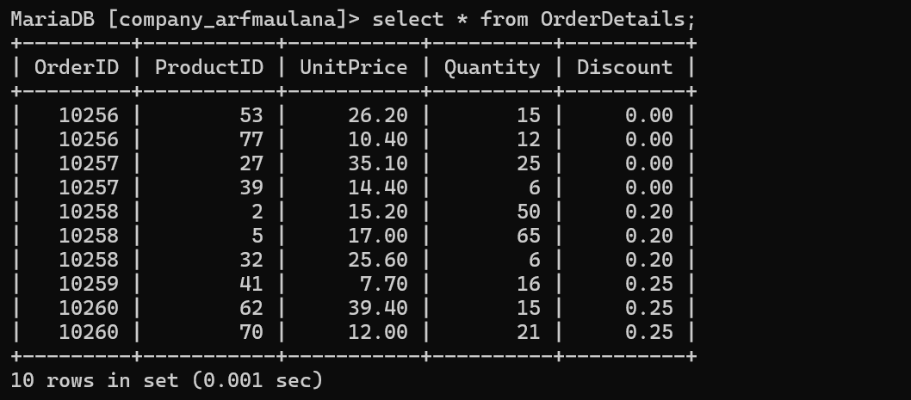

## Select Lanjutan
Code:

~~~sql
SELECT Orders.OrderID, Orders.OrderDate, Orders.CustID,
Customers.CompanyName, Customers.ContactName, Customers.City,
Customers.Phone
FROM Orders, Customers
WHERE Orders.CustID = Customers.CustomerID;
~~~

Penjelasan:
SELECT = untuk memilih kolom mana saja Yanu ingin ditampilkan dan dari tabel mana
kolom tersebut diambil.

orders. Order ID = orders merupakan nama tabel Yang ingin ditampilkan kolomn Ya Yaitu
orderID. Jadi kolom orderID Pada tabel orders ingin ditampilkan. dalam

orders, order Date = kolom orderDate Pada tabel orders insin ditampilkan.

orders. CustID= kolom CustID dalam tabel orders dipilih untuk ditampilkan.

Customers. company Name = kolom company Name dalam tabel customers dipilih untuk
ditampilkan.

customers.contactName = kolom contactName dalam tabel customers dipilih untuk
ditampilkan.

customers. city kolom city dalam tabel customers dipilih untuk ditampilkan.
Customers. Phone = kolom Phone dalam tabel customers dipilih untuk ditampilkan.

FROM orders, customers = untuk memilih dari tabel mana saja yang kolomnya insin dipilih
untuk ditampilkan. Orders adalah nama tabel Pertama yang dipilih dan customers adalah
nama tabel kedua Yang dipilih.

WHERE Kondisi Yang harus dipenuhi oleh suatu kolom data avar bisa ditampilkan (orders.
custID = customers.customerID) =  kondisi dari WHERE an's harus dipenuhi.
Jadi, data Pada kolom custID dalam tabel orders harus sama dengan data Pada kolom
customerID dalam tabel customers avar masing-masing datarik bisa ditampilkan

 

Hasil:

Code :

~~~sql
SELECT O.OrderID, O.OrderDate, O.CustID,
C.CompanyName, C.ContactName, C.City,
C.Phone
FROM Orders O, Customers C
WHERE O.CustID = C.CustomerID AND C.City = "London";
~~~

Penjelasan:
SELECT = untuk memilih kolom mana saja yang ingin ditampilkan dan dari tabel mana
kolom tersebut diambil.

o. orderID = o merupakan Singkatan dari tabel orders, kolom order ID merupakan
kolom dari tabel orders Yang dipilih untuk ditumpilkan.

C. Company Name = C merupakan singkatan dari tabel customers. kolom company Name
merupakan kolom dari tabel customers Yang dipilih untuk ditamPilkan.

C. Contact Name = kolom contact Name merupakan kolom dari tabel c Yaitu customer Yang
dipilih untuk ditampilkan.

C. city = kolom city merupakan kolom dari tabel a Yaitu customers Yang dipilih
untuk ditampilkan,

C. Phone kolom Phone merupakan kolom dari tabel e Yaitu customers Yang dipilih untuk
ditampilkan.

FROM orders o, customers c = untuk memilih dari tabel mang saja yang kolomnia ingin
dipilih untuk ditampilkan. Orders adalah nama tabel yang dipilih untuk ditampilkan tapi
disingkat Jadi O, asar lebih mudah dan cepat. customers adalah nama tabel yang dipilih
untuk ditampilkan tapi disingkat Jadi C. - WHERE = kondisi yang harus dipenuhi oleh suatu
kolom data agar bisa ditampilkan.

(O.CustID= costumer ID) = data Pada kolom custID dalam tabel o (orders) hans Sama
dengan data Pada kolom customer ID dalam tabel c (customers). AND = untuk menyeloksi
dua data atau lebih Pada Perintah WHERE.

C.city = "London") = kondisi tambahan yang harus dipenuhi Juga. Jadi Pada kolom

Hasil :
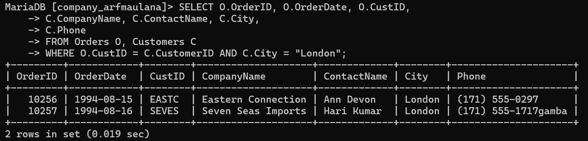

Code :

~~~sql
SELECT o.OrderID, o.OrderDate, c.CompanyName, c.ContactName, c.Phone, e.LastName,
e.Title
-> FROM orders o, customers c, employees e
-> WHERE o.CustID = c.CustomerID AND o.EmpID = e.EmpID;
~~~

Penjelasan:
SELECT = untuk memilih kolom mana saja Yan's insin ditampilkan dan dari tabel mana
kolom tersebut diambil.

o.orderID, o. order Date = kolom orderID dan order Date dati tabel o (orders) dipillh untuk
ditampilkan

C.companyName, c.contactName, c. Phone = kolom-kolom companyName, Contact Name
dan Phone dari tabel c(cocustomers) dipilih untuk ditampilkan.

e. Last Name, e. Title = kolom Lostname dan Title dari tabel e (employees) dipilih untuk
ditampilkan.

From orders o, customers c, employees e = untuk memilih dari tabel mana saja Yang
kolomnya dipillh untuk ditampilkan. orders disingkat Jadi o adalah nama tabel Yang dipilih.
customers disingkat Jadi C adalah nama tabel yang dipilih employees disingkat Jadi e
adalah nama tabel Yang dipilih untuk ditampilkan. 1-WHERE = kondisi Yang harus dipenuhi
oleh suatu data ayat bisa ditampilkan.

AND = untuk menyeleksi dua data atau lebih Pada Perintah WHERE

Hasil :

Code :
~~~sql
SELECT o.OrderID, o.OrderDate, c.CompanyName, c.ContactName, c.Phone,
e.LastName, e.Title
-> FROM orders o, customers c, employees e
-> WHERE o.CustID = c.CustomerID AND o.EmpID = e.EmpID AND e.FirstName =
"Margaret";
~~~

penjelasan:
SELECT=untuk memilih kolom mana saja Yang ingin ditumpilkan dan dari tabel mana kolom tersebut diambil.

o. order ID, o. order Date = kolom orderID dan orderDate dari tabel o (orders) dipilih untuk ditampilkan.

c.companyName, c.contuctilame, c. Phone = kolom company Name, ContactName danPhone dari tabel c (customers) dipilih untuk ditampilkan.

e. Lastname, e.Title = kolom LastName dan Title dari tabel e (employees) dipilih. untuk ditampilkan.

From orders o, customers c, employees e = untuk memilih dari tabel mana saja Yang
kolomnya dipilih untuk ditampilkan. orders atau o adalah nama tabel Yang dipilih untukditampilkan.

customers atau c adalah nama tabel Yang dipilih untuk ditampilkan employees
atau e adalah nama tabel yang dipilih untuk ditampilkan.

WHERE kondisi Yang harus dipenuhi 1% suatu kolom data avar bisa ditampilkan. 

(O.CustID = c. customerID) = data Pada kolom astID dalam tabel o (orders) harus Sama dengan data Pada kolom customerID davam table (customers).

SELECT o.OrderID, o.OrderDate, c.CompanyName, c.ContactName, c.Phone,
e.LastName, e.Title

AND = untuk menyereksi dua data atau lebih Pada Perintah WHERE.

(0.EmPId=e.EmPID) = data Pada kolom EmpId dalam tabel (orders) harus sama dengan data Pada kolom EmPID dalam tabel e (employees).

AND = untuk menyeleksi dua data atau lebih Pada Perintah WHERE. Le.FirstName =
"Margaret") = data Pada kolom Firstivame dalam tabel e(emploke) harus berisi data
"Margaret" agar bisa tampil...

Hasilnya Jadi barisan data yang sudah memenuhi kondisi WHERE akan tampil.

terutama kolom firstname dari tabel employees Yang isinya "Margaret.

Hasil :

Code :

~~~sql
SELECT c.CustomerID, c.CompanyName, o.OrderID,
-> o.OrderDate, od.ProductID, p.ProductName,
-> od.Quantity AS Qty, od.UnitPrice
-> FROM customers c,orders o, orderdetails od,products p
-> WHERE c.CustomerID = o.CustID AND o.OrderID = od.OrderID
-> AND p.ProductID = od.ProductID
-> ORDER BY c.CustomerID;
~~~

penjelasan:
SELECT untuk memilih kolom mana sata Yang ingin ditampilkan dan dari tabel mana kolom tersebut diambil.
C.CustomerID, C. company Name = kolom customerID dan companyName dari tabel C.(customers) dipilih untuk ditampilkan. 1-0. order ID, o, order Date = kolom orderID dan
orderDate dari tabel o(orders) dipilih
od. ProductID, ad. Quantity, od. unit Price = kolom ProductID, Quantity dan unitPrice dari
tabel od (orderdetails) dipilih uritur ditampilkan.
od. Quantity AS Qty = kolom Quantity ditampilkan sebagai nama sementaranya Yaitu aty. As
untuk menjubah nama suatu kolom Secara sementara.

P.ProductName = kolom ProductName merupakan kolom dari tabel P(Products) Yang
dipilih untuk ditampilkan.

WHERE = Kondisi Yang harus dipenuhi oleh suatu kolom data avar bisa ditampilkan
test) (c.customerID = 0.CustID) = data Pada kolom customerID dari tabel customers atau harus sama dengan data Pada kolom custID dari tabel orders atau 0. 00
AND = Untuk menyeleksi dua data atau lebih Pada perintah WHERE.

(der) (o. orderID = Od. orderID) = data Pada kolom order ID dari tabel orders atau o harus sama dengan data Pada kolom orderId dati tabel orderdetails atau od.

AND untuk menyeleksi dua data atau lebih Pada Perintah WHERE.
(Products) (P.ProductID = od. ProductID) = data Pada kolom Productio dari tabel Products atau P harus sama dengan data Pada kojom ProductID dari tabel ordendetails atau d..

Hasil :

Code :

~~~sql
SELECT c.customerid, c.companyname, o.orderid as OrdID, o.orderdate,
CONCAT(e.lastname, ',',e.firstname) AS EmployeeName, od.productid as ProdID,
-> p.productname, od.quantity AS Qty FROM customers c, orders o, orderdetails
od, products p,employees e
-> WHERE c.customerid=o.custid and o.orderid=od.orderid and
p.productid=od.productid and e.empid=o.empid order by o.orderid;
~~~

penjelasan:
SELECT = untuk memilih kolom mana saja Yang ingin ditampilkan dan divabundkon serta dari tabel mana kolom tersebut dipilih.
c. customerID, C.Company Name = kolom customerID dan company Name dari tabel
c(customers) dipilih untuk ditampilkan.
o.order ID AS ordID, O.order Date = kolom orderID dan order Date dari tabel o(orders) dipilih
untuk ditampilkan. As merupakan Perintah untuk mengubah nama Suatu kolom Secara
sementara. Dalam hal ini kolom orderID diubah namanya sementara mentid ordID.
CONCAT (e-Lastrome,,, e. FirstName) AS EmployeeName = CONCAT adalah Perintah
untuk menggabungkan beberapa kolom data menjadi satu kolom data. (e. Lastname, e. First
Name) merupakan kolom-kaom Yang ingin digabun LastName dan First Name merupakan
kolom dari tabel e(employees) Yand indin digabung. ('.') merupakan separator atau Pemisah
dari kedua kolom Yang ingin divabungkan. anform
As EmployeeName untuk mengubah hasil concat tadi menjadi Employeenoor (namanya)
untuk sementara.
od. Product ID AS ProdID, od. Quantity AS Qty = kolom ProductID dan quantity dari tabel od
(orderdetails), dipilih untuk ditampilkan, kolom ProductID
namanya diubah sementara Jadi ProdID. kolom Quantity namanya diubah Sementara Jadi
Qty.
P. ProductName = kolom ProductName dari tabel P(Products) dipilih untuk ditampilkan.
From customers c. orders o, orderdetails od, Products P, employees e = untuk memitt dari
tabel mana saja yang kolomnya dipilih untuk ditampilkan customers atau C adalah nama
tabel Yang dipilih. orders atau o adalah nama tabel Yang dipilih order details od adalah
nama tabel Yang dipilih. Products atau P adalah nama tabel yang dipilih. employees atau e
adalah nama tabel Yant dipilih.
WHERE kondisi Yang harus dipenuhi oleh suatu kolom data avar bisa ditampilkan (CCustomerID
= o. CustID) = data Pada kolom customerID dari tabel c(customers) harus sama
dengan data Pada kolom CustIO dari tabel o(orders).
AND= untuk menyeleksi dua data atau lebih pada Perintah WHERE. 6.OrderID =
od.orderID) = data pada kolom orderID dari tabel o(orders) harus Sama dengan data Pada
kolom orderID dari tabel od (orderdetails).
AND = untuk menyeleksi dua data atau lebih Pada Perintah WHERE. (P.ProductID=od.
ProductID) = data Pada kolom ProductID dari tabel PCProductID) harus sama dengan data
Pada kolom ProductID dari tabel od (orderdetail AND = untuk menyeleksi dua data atau
lebih Pada Perintah WHERE. (e. EmPID = 0. EmPID) = data Poda kolom EmPID dari tabel
e(employees) harus sama dengan data Pada kolom EmPID dati tabel o(orders). order BY o.
orderID = untuk mengurut data berdasarkan kolom orderID dari tabel orders.
Hasilnya kolom LastName dan FirstName dari tabel e(employees) digabung dengan Concat
dan hasil kolomnya namanya diubah sementara Jadi EmployeeName.
Hasil :

Code :

~~~sql
CREATE VIEW CustOrderEmp
AS
SELECT c.CustomerID, c.CompanyName, c.ContactName,
o.OrderID, o.OrderDate, e.EmpID, e.LastName, e.FirstName
FROM customers c,orders o, employees e
WHERE c.CustomerID = o.CustID AND o.EmpID = e.EmpID;
~~~

penjelasan:
CREATE VIEW Custorder Emp = merupakan tabel virtual Yang dibuat dendan Nama
custorderEmp
AS SELECT = untuk memilih kolom-kolom mana Sava Yang ingin dipilih untuk dimasukkan
ke tabel virtual.
C. CustomerID, c.companyName, c.contactName = kolom customerID, company Name dan
contactinome dari tabel c(customers) dipilih untuk dimasukkan ke dalam tabel virtual.
0.order ID, o. order Date = kolom order ID dan orderlate dari tabel (orders) dipilih untuk
dimasukkan ke dalam tabel virtual.
e-EmPID, e.Lastname, e. FirstName = kolom EmPID, LastName, dan firstName.dati tabel
e(employees) dipilih untuk dimasukkan ke dalam tabel virtual.
FROM customers c, orders o, employees e = untuk memilih dari tabel mana Sara Yang
kolomnya dipilih untuk dimasukkan. customers, orders dan employees merupakan nama
tabel yang kolomnya dipilih.
WHERE kondisi yang harus dipenuhi oleh suatu data adar bisa dimasukkan ke dalam tabel
virtual.
(c.customerID = a custID) = data Pada kolom customerID dari tabel c(costumers) harus
sama dengan data pada kolom custID dari tabel (orders) adar bisa dimasukkan.
AND = untuk menyeleksi dua data atau lebih Pada WHERE.
(O. EMPID = e.EmPID) = data Poda kolom EmPID dari tabel ocorders) harus Sama dengan
data Pada kolom EmPID dari tabel e(employees) avar bisa dimasukkan.
Hasilnya sebuah Tabel virtual telah dibuat dengan nama custorder Emi Yang berisi kolomkolom
dari 3 Tabel customers, orders, employees dan telah memenuhi semua kondisi.

Hasil :

Code :

~~~sql
CREATE VIEW odproducts
AS
SELECT od.OrderID, od.ProductID, p.ProductName,
od.Quantity, od.UnitPrice
FROM orderdetails od, products p
WHERE p.ProductID = od.ProductID;
~~~

penjelasan:
CREATE VIEW od Products = untuk membuat tabel virtual dengan nama od products. AS
SELECT = untuk memilih kolom-kolom mana saja Yand ingin dipilih untuk dimasukkan ke
tabel virtual.
od.orderID, od. ProductID, od. unitPrice, od. quantity = kolom order ID, ProductID, unit Price
dan Quantity dari tabel od (orderdetails) dipilih untuk dimasukkan. P. ProductName = kolom
Productivame dari tabel P(Products) dipilih untuk dimasukkan. - From orderdetails od,
Products P = untuk memilih dari tabel mana saja yang kolomnya dipilih untuk dimasukkan.
Orderdetails dan Products adalah nama tabel Yang dipilih.
WHERE kondisi Yang harus dipenuhi oleh suatu data agar bisa dimasukkan ke dalam tabel
virtual.
-(P.ProductID = od. ProductID) = data Pada kojom productID dari tabel P(Products) hans
sama dengan kolom ProductID dari tabel od (orderdetails). avar bisa dimasuktin Hasilnya
Tabel virtual yang bernama odproducts yang terbuat dari kolom dalam

Hasil :

Code :

~~~sql
SELECT c.customerid, c.companyname, o.orderid, od.productid,
ROUND(od.unitprice,2), od.quantity,
od.discount, ROUND(((1-od.discount)*od.unitprice*od.quantity),2) AS Jumlah
FROM customers c, orders o, orderdetails od WHERE c.customerid=o.custid
AND o.orderid=od.orderid
ORDER BY c.customerid;
~~~

penjelasan :
SELECT untuk memilih Kolom mana saja Yang ingin ditampilkan dan dihitung.
c. customerID, C. company Name = kolom customerID dan company Name dari tabel
c(customers) dipilih untuk ditampilkan.
orderID = kolom orderID dari tabel o (orders) dipilih untuk ditampilkan. Od. Product ID,
od.unitPrice, od. quantity, od. Discount = kolom ProductID, unit Price, Quanti dan
Discount dari tabel Od (orderdetails) dipilih untuk ditampilkan dan dibulatkan.
ROUND (od unitprice, 2) = untuk membulatkan bilangan dari kojom unitPrice Sampai
Jumlah digit tertentu. sesuai dengan pilihan yang dibuat
Yaitu 2.
ROUND (CC1-od. Discount) ad.unitPrice od. Quantity), 2) AS Jumlah = untuk membulatkan
bilangan dari kolom hasil dari (1 dikurang kolom discount lalu dikali @unitprice dan kali
Quantity) sampai jumlah digit Yaitu 2... As Jumlah untuk menJubah kolom hasil tersebut
nama sementaranya Jodi Jumlad From customers c, orders o, orderdetails od untuk memilih
dari tabel mona Sara yang kolamnya dipilih untuk ditampilkan dan dibulatkan. customery,
orders, orderdetails merupakan nama-nama tabel yang dipilih. WHERE kondisi yang harus
dipenuhi oleh suatu data agar bisa ditampilkan. (C. customer ID = o. cust ID) = data Pada
kolom CustomerID M. dari tabel ccoustomers) harus sama dengan data Poda kolom custID
dari tabel o(orders). AND = untuk menyeleksi dua data atau lebih Pada kondisi WHERE.
(O.order ID = od-order ID) = data Pada kolom orderID dari tabel o(orders) hotus
Sama dengan data Pada kolom OrderID dari tabel od (orderdetails).
ORDER BY c.customerID = untuk mengurut data berdasarkan kolom customers
dari tabel c(customers).
Hasil akan tampil hasil Pembulatan dari kotom-kolom Yang telah memenuhi kondisi dari WHERE

Hasil :

Code :

~~~sql
SELECT c.customerid, c.companyname, ROUND(SUM((1-
od.discount)*od.unitprice*od.quantity),2) AS TotalJumlah
FROM customers c, orders o, orderdetails od WHERE c.customerid=o.custid
AND o.orderid=od.orderid
GROUP BY c.customerid, c.companyname ORDER BY c.customerid;
~~~

penjelasan :
SELECT = untuk memilih kolom mana saja yang ingin ditampilkan dan dibulatk
C.CustomerID, C.Company Name = kolom customerID dan companyName dati tabel
(customers) dipilih untuk ditampilkan.
ROUND (Sum((1-od.discount) od. unit Price od. quantity), 2) AS Total Jumlah = untuk
membulatkan hasil sum dari ((1 dikurang kolom Discount) dikali unitPrice Kali Quantity)
sampai 2 digit.
200
Dan nama kolom hasilnya diubah sementara Jadi TotalJuinlah. FROM customers c, orders
o, orderdetails od = untuk memilih dari tabel mana Saja Yang kolomnya dipilih untuk
ditampilkan dan dibulatkan. customers, Orders dan orderdetails, adalah nama, tabel yang
dipilih.WHERE = kondisi Yand harus dipenuhi oleh suatu data alar bisa ditampilkan. -
(c.customerID=0.custID) = data Pada kolom customerID dati tabel c(customers) harus sama
dengan data Pada kolom CustID dari tabel o (orders). AND = untuk menyeleksi dua data
atau lebih lada kondisi WHERE.
(o.orderID) = od.orderID) = data Pada kolom orderID dari tabel o (orders). horus Sama
dengan data Pada kolom orderID dari tabel od(orderdetails). GROUP BY c.customerID,
C.CompanyName = untuk mengelompokkan data sesuai dengan kolom customerID dan
company Name dari tabel c(customers).
ORDER BY c.customerID = untuk mengurut data berdasarkan kolom customerID dari tabel
c(customers)
Hasilnya = tadi, Kolom Yang dikelompokkan adalah customerID dan company Name dan
tampilannya diurutkan berdasarkan kolom customerID.

Hasil :

