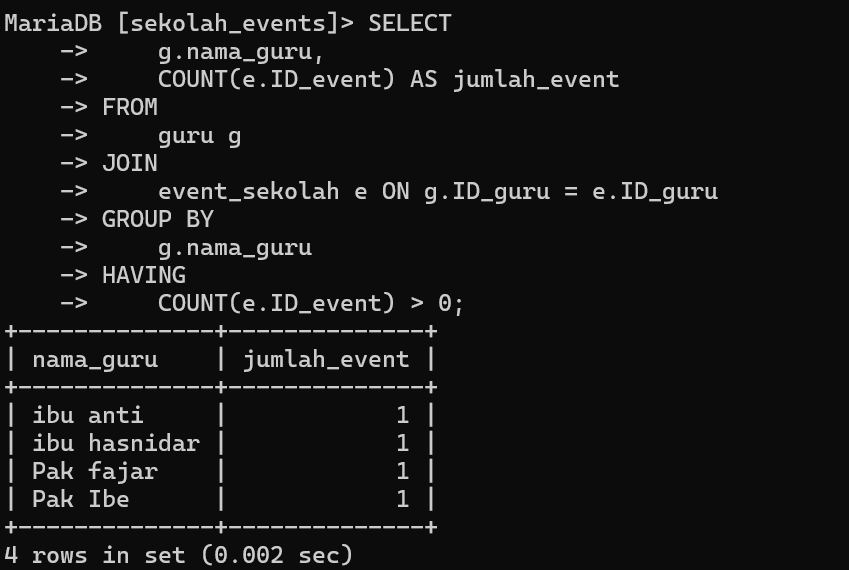
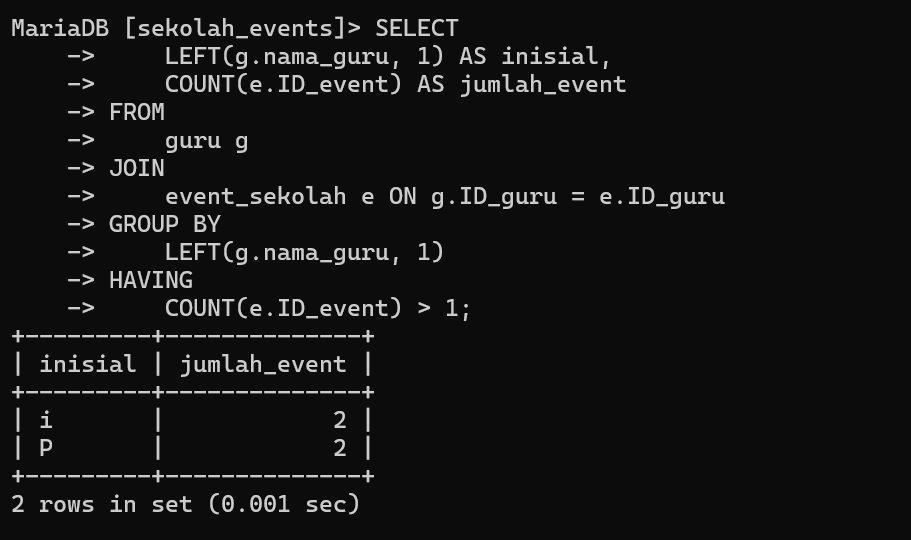

# Soal 1

## penjelasan
Query SQL yang Anda tulis bertujuan untuk menampilkan **nama guru** dan **jumlah event** yang diikutinya dari dua tabel: `guru` dan `event_sekolah`
## program
~~~sql
SELECT
    ->     g.nama_guru,
    ->     COUNT(e.ID_event) AS jumlah_event
    -> FROM
    ->     guru g
    -> JOIN
    ->     event_sekolah e ON g.ID_guru = e.ID_guru
    -> GROUP BY
    ->     g.nama_guru
    -> HAVING
    ->     COUNT(e.ID_event) > 0;
~~~

## Analisis
- SELECT Clause: **g.nama_guru:** Menampilkan nama guru dari tabel `guru`.
- **COUNT(e.ID_event):** Menghitung jumlah event yang terhubung dengan setiap guru.
- **AS jumlah_event:** Memberikan alias `jumlah_event` untuk hasil perhitungan, agar lebih mudah dibaca.
- FROM Clause: Mengambil data dari tabel `guru` dan memberikan alias `g` untuk tabel ini agar lebih ringkas dalam penulisan.
- JOIN Clause: Menggabungkan tabel `guru` dengan tabel `event_sekolah` menggunakan **INNER JOIN**.
- **ON g.ID_guru = e.ID_guru:** Menentukan kondisi penggabungan, yaitu mencocokkan kolom `ID_guru` dari kedua tabel untuk memastikan data yang sesuai.
- GROUP BY Clause: Mengelompokkan data berdasarkan **nama_guru**.
- Setiap guru akan dihitung jumlah event yang terkait dengannya.
- HAVING Clause:  **HAVING** berfungsi untuk memfilter hasil pengelompokan.
- **COUNT(e.ID_event) > 0**: Menyaring guru yang memiliki lebih dari **0 event**, sehingga hanya guru yang terlibat dalam minimal satu event yang ditampilkan.

## hasil:

## penjelasan
query ini menampilkan **inisial nama guru** (huruf pertama) dan **jumlah event** yang dikelola oleh guru-guru yang memiliki lebih dari satu event. Tabel `guru` dan `event_sekolah` digabungkan menggunakan `JOIN`, lalu data dikelompokkan menggunakan `GROUP BY` berdasarkan inisial nama guru.

## program

~~~sql
SELECT
    ->     LEFT(g.nama_guru, 1) AS inisial,
    ->     COUNT(e.ID_event) AS jumlah_event
    -> FROM
    ->     guru g
    -> JOIN
    ->     event_sekolah e ON g.ID_guru = e.ID_guru
    -> GROUP BY
    ->     LEFT(g.nama_guru, 1)
    -> HAVING
    ->     COUNT(e.ID_event) > 1;
~~~

## Analisis
1. SELECT Clause:
- **LEFT(g.nama_guru, 1):** Mengambil huruf pertama dari kolom `nama_guru` untuk mendapatkan inisial nama.
- Contoh: "Pak Ibe" akan menghasilkan inisial `P`.
- **COUNT(e.ID_event):** Menghitung jumlah event yang terkait dengan guru berdasarkan inisial.
- **AS inisial:** Alias untuk hasil `LEFT(g.nama_guru, 1)` supaya lebih mudah dibaca.
- **AS jumlah_event:** Alias untuk hasil `COUNT(e.ID_event)`.

2. FROM Clause: 
- Mengambil data dari tabel `guru` dengan alias `g`.

3. JOIN Clause: 
- Menggabungkan tabel `guru` dengan tabel `event_sekolah`.
- **ON g.ID_guru = e.ID_guru:** Kondisi penggabungan yang mencocokkan `ID_guru` di kedua tabel.

4. **GROUP BY Clause:**
- Mengelompokkan data berdasarkan **inisial nama guru**.
- Semua guru dengan inisial yang sama akan dihitung jumlah event-nya.

5. HAVING Clause:
- Menyaring hasil agar hanya menampilkan inisial yang memiliki lebih dari **1 event**.
- Guru dengan **jumlah event lebih dari 1** akan ditampilkan.

## hasil

